# Exploratory Data Analysis - "Go To College" Dataset - Group 4

Exploratory Data Analysis (EDA) ini bertujuan untuk mengeimplementasikan hasil pembelajaran sejauh ini dalam modul 2 program JCDS dengan menggunakan dataset "Go To College" oleh Saddam Sinatrya Jalu Mukti melalui [kaggle](kaggle_source). EDA ini disusun oleh Group 4 yang bergerak sebagai tim konsultan analisis data.

## "Go To College" Dataset Analysis
Dikutip dari situs [kaggle](kaggle_source):
>This is a synthetic data created for a college project. This data aims to predict whether students will continue to go to college or not. With machine learning explainability, school counselors can help students that will not go to college by finding the factor and helping them. Lets build something really helpful.

## Objective
Tugas utama kami adalah untuk mengaplikasikan apa yang telah kami pelajari dalam bidang fundamental data analysis untuk memberikan insight berdasarkan data siswa-siswi yang ada sehingga kami bisa menyimpulkan rekomendasi terbaik untuk clien kami, yaitu Universitas Swasta atau Institusi Pendidikan.

## Our Client
Hasil insight kami diperuntukkan kepada Universitas Swasta dan/atau Institusi Pendidikan lainnya yang membutuhkan formulasi strategi untuk meningkatkan jangkauan dan efektivitas marketing mereka.

[kaggle_source]:https://www.kaggle.com/datasets/saddamazyazy/go-to-college-dataset

## Business Questions
1. Apakah ada hubungan antara identitas gender siswa-siswi dan keputusan mereka untuk melanjutkan pendidikan mereka ke perguruan tinggi?
2. Apakah lokasi tempat tinggal siswa-siswi berpengaruh terhadap keputusan mereka untuk meneruskan pendidikan mereka?
3. Apakah jawaban survey perihal minat/_interest_ siswa-siswi dapat akhirnya memprediksi keputusan siswa-siswi untuk melanjutkan studi mereka ke tahap perkuliahan?
4. Apakah siswa-siswi yang pada akhirnya memutuskan untuk meneruskan pendidikan mereka memiliki nilai yang lebih tinggi semasa sekolah?
5. Apakah pendapatan orang tua murid berpengaruh terhadap keputusan siswa-siswi untuk melanjutkan pendidikan mereka ke tahap perkuliahan?
6. Apakah keputusan siswa-siswi untuk meneruskan ke perguruan tinggi dipengaruhi oleh apakah orang tua mereka juga dulu berkuliah?
7. Apakah tingkat akreditasi sekolah, baik sekolah akademik atau sekolah vokasi, dapat menjamin banyaknya siswa-siswi yang melanjutkan studi mereka ke tahap perkuliahan?
8. Berapakah rata-rata umur orang tua murid?

## Code Outline
1. Deskripsi Data
2. Pencarian Insight

## 1. Deskripsi Data
---
Pada bagian ini, kami akan menjelaskan tahapan penyajian data yang kami lakukan agar data selanjutnya bisa dianalisis.

### 1.1. Import Data

Dalam tahap ini, pertama kami mengimport libraries yang akan kami gunakan untuk project ini, yaitu _NumPy_ dan _Pandas_. Kemudian, kami menggunakan `pd.read_csv` dan `head(10)` untuk menampilkan 10 data pertama dari dataframe yang sudah kita masukkan ke variabel `df`.

### 1.2. Insert Index
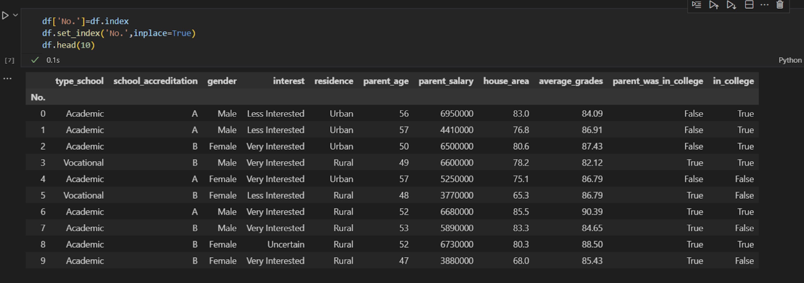

Dalam tahap ini, kami merapikan tampilan dataframe dengan menetapkan `'No'`sebagai index dataframe kami.

### 1.3. Define Data Type Per Column

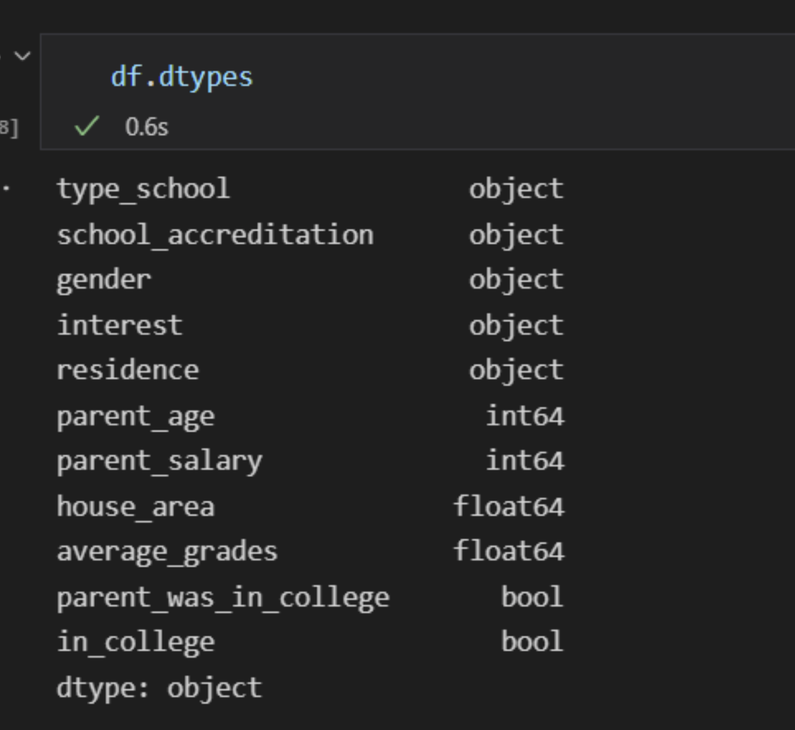

Dalam tahap ini, kami menampilkan tipe data per column yang ada dalam dataframe kami. Ini dilakukan agar kami bisa mengolah data tiap-tiap column sesuai dengan tipe data yang ada.

### 1.4. Describe
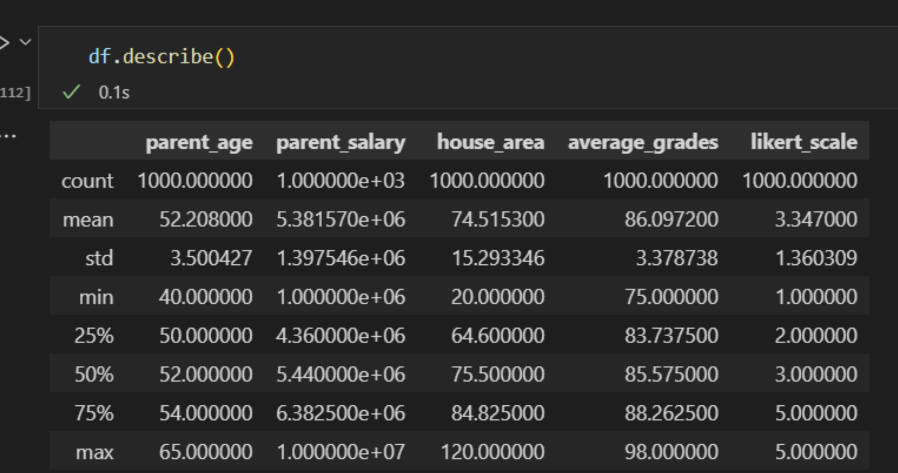

Menggunakan fungsi `df.describe`, keterangan agregat data dapat ditampilkan. Dan dari keterangan tersebut, kami sudah bisa menyimpulkan beberapa insight sebagai berikut:
> 1.  Dari data seluruh siswa-siswi, rata-rata (_mean_) nilai yang mereka dapatkan adalah 86, dengan nilai tertinggi yaitu 98, terendah yaitu 75, dan angka tengah (_median_) adalah 85.57.
> 
> 2. _Median_ yang dicapai (85.57) itu tidak jauh dari angka _Mean_ (86), sehingga dapat disimpulkan bahwa **data terdistribusi secara normal**.
> 
> 3. Dari cuplikan data di atas, standar deviasi (_std_) yang didapat tergolong rendah. Sehingga dapat disimpulkan bahwa **variasi data tidak besar**.
>
> 4. Rata-rata umur orang tua murid adalah **52 tahun**.

### 1.5. Check Missing Value
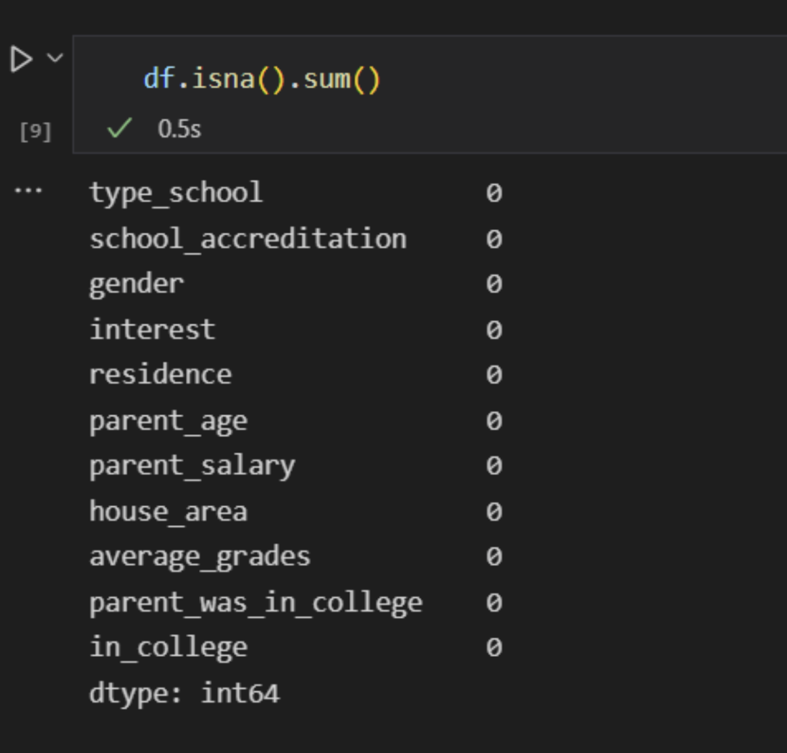

Menggunakan fungsi `df.isna().sum()`, data kosong di dalam kolom-kolom dataframe akan dihitung. Seperti yang bisa dilihat di cuplikan di atas, data kosong tidak ada di dalam dataframe (semua data terisi).

## 1.6. Set "Interest" Column into a Likert Scale
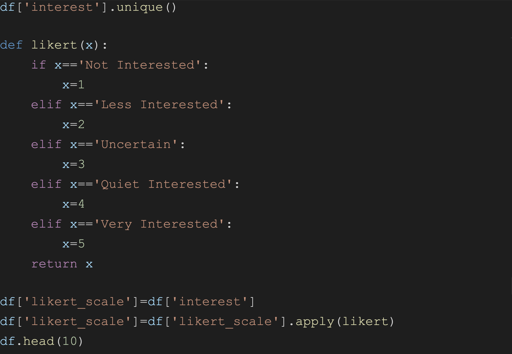

Dalam tahap ini, kami mendefinisikan sebuah fungsi yang bernama `likert()`. Fungsi ini berfungsi sebagai _converter_ column interest yang sebelumnya berisi `string` menjadi angka skala Likert. Skala ini terdiri dari angka 1 s/d. 5 dengan angka 1 yang merepresentasikan `"Not Interested"` atau sangat tidak tertarik hingga angka 5 yang merepresentasikan `"Very Interested"` atau sangat tertarik. Ini dilakukan agar isi data dari column `Interest` bisa menjadi numerik sehingga lebih mudah diolah.

## 2. Pencarian Insight
---
Pada bagian ini, menggunakan data yang sudah disiapkan, kami akan memulai analisis data untuk menghasilkan insight dan kesimpulan.

### 2.1. Academic/Vocational Students Mapping
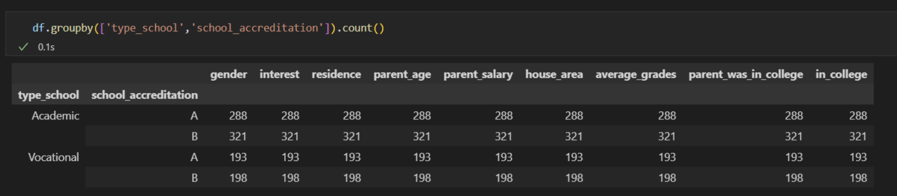

Dalam tahap ini, kami memetakan (_mapping_) data jumlah siswa-siswi dari sekolah akademik dan vokasi, masing-masing dari akreditasi A dan B,dengan menggunakan fungsi `groupby()` dan `count()`. Dan dari hasil pemetaan tersebut, kami dapat menyimpulkan beberapa insight sebagai berikut:
 
> 1. Perbandingan antara jumlah siswa-siswi **Sekolah Akademik** dengan **Sekolah Vokasi** adalah **3:2**, di mana jumlah siswa-siswi Sekolah Akademik adalah **609** dan jumlah siswa-siswi Sekolah Vokasi adalah **391**.
>
> 2. Meskipun kami berasumsi bahwa sekolah berakreditasi A, baik dari sekolah akademik atau sekolah vokasi, akan _menghasilkan_ jumlah siswa-siswi perguruan tinggi lebih banyak, ternyata data hasil survey menunjukkan bahwa **jumlah siswa-siswi yang melanjutkan pendidikan mereka ke perguruan tinggi dari sekolah berakreditasi A lebih sedikit dari sekolah akademik berakreditasi B**. Dengan perbandingan jumlah siswa-siswi dari sekolah akademik akreditasi A:B yaitu (**288:321**) dan sekolah vokasi akreditasi A:B yaitu (**193:198**). Sehingga dapat disimpulkan bahwa **tingkatan akreditasi belum tentu menjamin banyaknya jumlah siswa yang melanjutkan pendidikan mereka ke perguruan tinggi**. 

### 2.2. Students That Do Go To College and Do Not, Genderwise
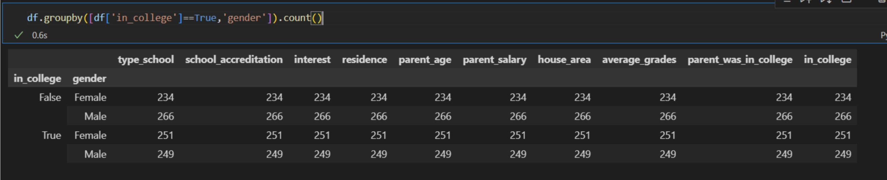

Dalam tahap ini, juga menggunakan fungsi `groupby()` dan `count()`, kami memetakan data siswa-siswi dari kedua sekolah sesuai gender. Dan dari hasil pemetaan tersebut kami dapat menyimpulkan beberapa insight sebagai berikut:

1. 
> Perbandingan antara jumlah siswa-siswi yang melanjutkan pendidikannya ke perguruan tinggi dan jumlah siswa-siswi yang tidak adalah **500:500**, atau sebanding.
2. 
> Oleh karena itu, dapat disimpulkan bahwa tidak ada pengaruh gender terhadap keputusan untuk melanjutkan pendidikan ke tahap perkuliahan atau tidak.

### 2.3. Survey Answer Reliability Analysis: Interest vs. Tendency To Go To College
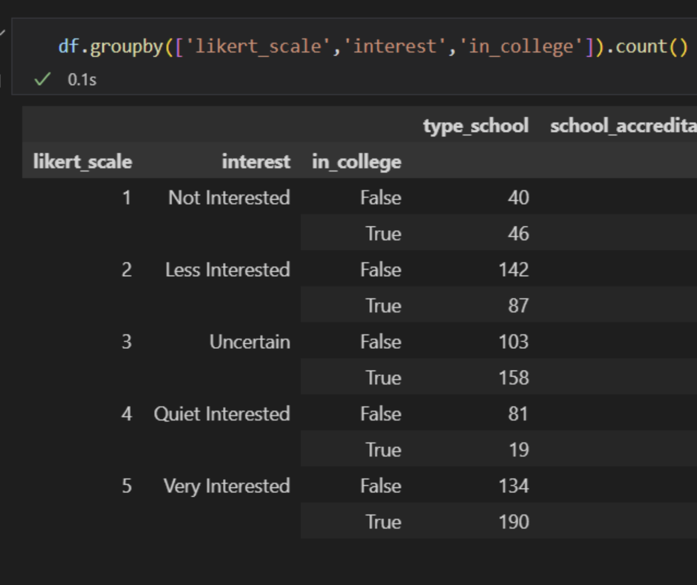

Dalam tahap ini, kami ingin melihat apabila data kecenderungan siswa-siswi atau _interest_  yang sudah kami konversikan ke skala likert di tahap 1.6 bisa menunjukkan konsistensi, yang berarti, siswa-siswi yang menjawab `interested` memang cenderung melanjutkan pendidikan mereka ke perguruan tinggi, dan apabila siswa-siswi yang menjawab `less interested` memang cenderung _tidak_ melanjutkan ke perguruan tinggi. Kami melakukan ini dengan mengambil hasil konversi fungsi `likert` di tahap 1.6. dan kemudian memeta data tersebut dengan kolom `in_college`. Dengan begitu, irisan kedua data tersebut dapat ditampilkan. Berikut adalah insight yang dapat kami simpulkan:

> Meskipun kami awalnya berasumsi bahwa siswa-siswi yang menjawab `Not Interested` juga _tidak_ melanjutkan pendidikan mereka ke perguruan tinggi, ternyata data hasil survey menunjukkan bahwa jumlah siswa-siswi tersebut yang tetap melanjutkan studi mereka dan tidak itu cenderung setara. Sementara itu, siswa-siswi yang menjawab `Quite Interested` justru cenderung tidak melanjutkan pendidikan mereka ke perguruan tinggi. Oleh karena itu, kami dapat menyimpulkan bahwa jawaban survey _**tidak**_ bisa merepresentasikan konsistensi minat dan keputusan siswa-siswi untuk melanjutkan pendidikan mereka ke perguruan tinggi.

### 2.4. Residency Analysis
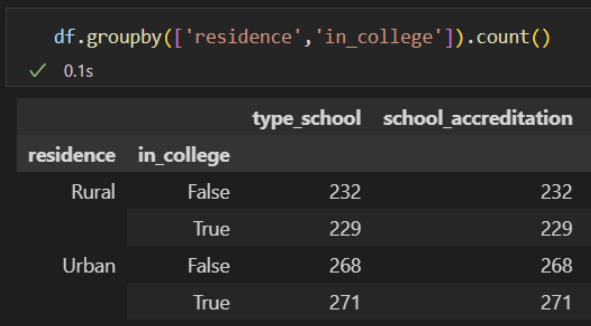

Dalam tahap ini, melalui proses pemetaan data, kami ingin melihat apabila lokasi tempat tinggal siswa-siswi (`Rural` vs. `Urban`) itu memengaruhi keputusan siswa-siswi tersebut untuk melanjutkan studi mereka. Berikut adalah insight yang dapat kami simpulkan:

> Dari dataset yang ada, dapat terlihat bahwa jumlah siswa-siswi dari kedua kategori lokasi tempat tinggal itu cenderung seimbang, baik yang melanjutkan atau tidak melanjutkan pendidikan mereka ke perguruan tinggi. Sehingga, dapat disimpulkan bahwa lokasi tempat tinggal _**tidak**_ memengaruhi tingkat masuk kuliah. 

### 2.5. Parental Education vs. Student's Tendency To Go To College
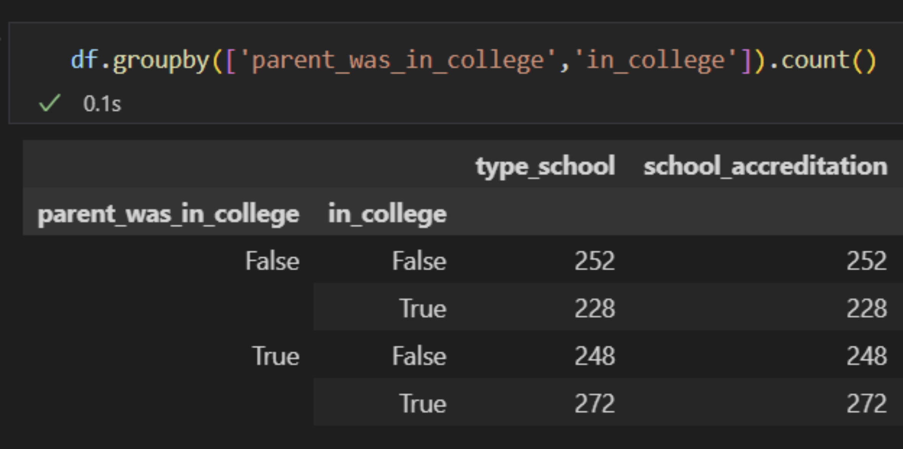 

Dalam tahap ini, kami mengambil data dari kolom `parents_was_in_college` dan melihat irisan data tersebut dengan jumlah siswa-siswi yang melanjutkan studi mereka. Kami melakukan ini untuk melihat apakah orang tua murid yang dulunya melanjutkan pendidikan mereka ke tahap perkuliahan memengaruhi keputusan siswa-siswi untuk juga melanjutkan studi mereka. Dan dari pemetaan tersebut, berikut insight yang dapat kami simpulkan:

> Dari dataset yang ada, dapat disimpulkan bahwa pendidikan orang tua murid tidak memengaruhi keputusan siswa untuk melanjutkan pendidikan mereka. Ini dikarenakan, seperti yang terlihat dari pemetaan di atas, jumlah orang tua murid yang dulunya kuliah dan tidak, dan jumlah siswa-siswi yang meneruskan pendidikan mereka dan tidak, itu seimbang.

### 2.6. Detailed Description of Students That _Do_ Go To College
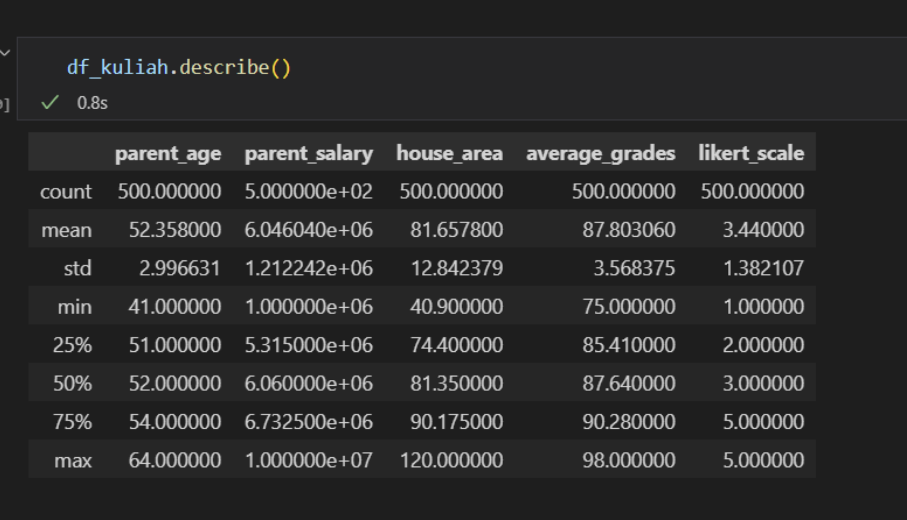 

Dalam tahap ini, kami membuat sebuah dataframe baru untuk melihat keterangan lebih lanjut mengenai siswa-siswi yang menentukan untuk meneruskan pendidikan mereka. Dataframe ini bernama `df_kuliah` dan berisi data numerik sesuai dengan kolom-kolom yang ada di tahap 1.2. Kemudian dengan fungsi `describe()`, keterangan agregat dari data-data tersebut dapat dilihat. Dan dari keterangan tersebut kami dapat menyimpulkan insight sebagai berikut:

> 1. Rata-rata nilai yang didapatkan oleh siswa-siswi yang pada akhirnya menentukan untuk melanjutkan pendidikan mereka ke perguruan tinggi adalah 87,8. Sedangkan dibandingkan dengan data dari 1.4., rata-rata nilai siswa-siswi secara keseluruhan adalah 86. Sehingga, nilai rata-rata siswa-siswi yang berkuliah lebih tinggi dari rata-rata nilai secara keseluruhan.
>
> 2. Rata-rata gaji orang tua murid yang anaknya melanjutkan ke perguruan tinggi adalah 6 juta rupiah. Sedangkan rata-rata semua orang tua murid adalah 5.3 juta rupiah. Oleh karena itu, orang tua murid yang anaknya melanjutkan ke perguruan tinggi memang diatas rata-rata keseluruhan orang tua murid.
>
> 3. Rata-rata skala Likert minat siswa-siswi untuk melanjutkan ke pergeruan tinggi berada di 3.44 berarti memang cenderung mau kuliah

## Recommendations
---
Setelah melakukan analsis data dan berdasarkan insights yang telah kami dapatkan, berikut adalah rekomendasi-rekomendasi yang dapat kami berikan kepada **Client** kami, dengan urutan sesuai dengan **Business Questions** yang telah kami berikan:

1. Tidak ada hubungan antara gender siswa-siswi dan keputusan mereka untuk melanjutkan pendidikan mereka ke perguruan tinggi. Oleh karena itu, **tidak perlu berpromosi secara khusus ke sekolah khusus laki-laki atau perempuan atau menyesuaikan konten promosi ke salah satu dari keduanya**[[1]](#1).

2. Jumlah siswa-siswi yang tinggal di pemukiman _urban_ yang memutuskan untuk melanjutkan ke perguruan tinggi 8% lebih tinggi dari siswa yang tinggal di pemukiman _rural_.  **Karena selisihnya di bawah 10%, kami sarankan untuk lebih banyak melakukan promosi luring di daerah perkotaan (_urban_) karena promosi luring di pemukiman _rural_ membutuhkan biaya tambahan untuk transportasi dan akomodasi. Demikian pula sebaliknya, yaitu lakukan lebih banyak promosi daring untuk siswa di pemukiman _rural_.**

3. Hasil survei perihal ketertarikan siswa-siswi untuk melanjutkan pendidikan mereka ke perguruan tinggi yang terdapat dalam dataset ini tidak dapat memprediksi dan menggambarkan keputusan mereka pada akhirnya. Oleh karena itu, **kami menyarankan untuk mencari sumber kuesioner yang lebih bisa diandalkan untuk menjawab pertanyaan/_Business Question_ tersebut. Dan penggunaan skala Likert genap sangat kami butuhkan sehingga kami dapat menghilangkan ketidakpastian pendapat responden**[[2]](#2).

4. Siswa-siswi yang melanjutkan ke perguruan tinggi memiliki nilai akademik yang lebih tinggi di atas rata-rata siswa-siswi secara keseluruhan. Sedangkan siswa-siswi yang tidak melanjutkan ke perguruan tinggi memiliki nilai yang lebih rendah di bawah siswa-siswi rata-rata. Oleh karena itu, **jika Klien dihadapkan pada 2 pilihan sekolah atau lebih, prioritaskan lebih banyak pada sekolah yang menghasilkan nilai rata-rata per siswa lebih tinggi daripada yang lebih rendah**[[3]](#3).

5. Orang tua yang anaknya masuk ke perguruan tinggi memiliki rata-rata gaji yang lebih tinggi di atas rata-rata keseluruhan orang tua murid. Sedangkan siswa-siswi yang tidak melanjutkan ke perguruan tinggi memiliki orang tua dengan rata-rata gaji yang lebih rendah. Oleh karena itu, **jika Klien dihadapkan pada 2 atau lebih pilihan sekolah, kami sarankan untuk memprioritaskan sekolah yang memiliki biaya pendidikan lebih tinggi daripada pilihan lainnya**[[4]](#4).

6. Orang tua yang melanjutkan ke perguruan tinggi menunjukkan kecenderungan sebesar 8% lebih tinggi bagi anak-anak mereka untuk melanjutkan ke perguruan tinggi daripada orang tua yang tidak melanjutkan ke perguruan tinggi. Oleh karena itu, **jika Klien dihadapkan pada 2 atau lebih pilihan sekolah, lebih mengutamakan sekolah yang berada di daerah dengan tingkat pendidikan yang lebih tinggi daripada yang lebih rendah**[[5]](#5).

7. Rata-rata usia orang tua murid secara keseluruhan adalah sekitar 52 tahun. Orang-orang sekitar 52 tahun dikategorikan sebagai _gen. X_[[6]](#6). Dengan begitu, **karena orang tua murid adalah pelanggan nyata Klien kami, Klien harus membentuk kampanye pemasaran dengan target audiens _gen. X_**[[6]](#6).

8. Jumlah siswa-siswi yang melanjutkan ke perguruan tinggi dari sekolah akreditasi A lebih sedikit daripada sekolah akreditasi B, dengan persentase perbedaan sekolah akademik sebanyak 10% dan sekolah vokasi sebanyak 2,5%. Oleh karena itu, kami simpulkan bahwa tingkat akreditasi sekolah belum tentu bisa menjamin banyaknya jumlah siswa-siswi yang menentukan untuk melanjutkan ke perguruan tinggi. **Kami menyarankan untuk mencari data kuesioner dengan informasi akreditasi sekolah asal dan jalur masuk siswa-siswi ke perguruan tinggi yang mereka pilih. Karena sesungguhnya jalur tertentu memperhitungkan akreditasi sekolah asal calon siswa-siswi untuk masuk ke perguruan tinggi.**[[7]](#7).

## References
---
<a id="1">[1]</a> 
Adirakisiwi, A.G and Warmi, A., 2019.
The Gender Impact on Interest in Continuing Study.
Mathematics Education of University of Singaperbangsa Karawang.

<a id="2">[2]</a> 
Chyung et al., 2017.
Evidence-Based Survey Design: The Use of a Midpoint on the Likert Scale.

<a id="3">[3]</a> 
Laporan Hasil Ujian Nasional. 
_[Website](https://hasilun.puspendik.kemdikbud.go.id/#2019!sma!capaian!01&99&999!T&T&T&T&1&!2!&)_.

<a id="4">[4]</a> 
Harimurti, C.D.R., 2007.
Hubungan Antara Status Sosial Ekonomi Orang Tua dengan Minat Siswa Untuk Melanjutkan Studi ke Perguruan Tinggi.

<a id="5">[5]</a> 
Tingkat Penyelesaian Pendidikan Menurut Jenjang Pendidikan dan Provinsi. 
_[Website](https://www.bps.go.id/indicator/28/1980/1/tingkat-penyelesaian-pendidikan-menurut-jenjang-pendidikan-dan-provinsi.html)_.

<a id="6">[6]</a> 
Forbes' Three tips for marketing to generation X.
_[Website](https://www.forbes.com/sites/forbesagencycouncil/2021/05/12/three-tips-for-marketing-to-generation-x/?sh=526e0f827cf9)_.

<a id="7">[7]</a> 
SNMPTN 2020, Apakah Akreditasi Sekolah Asal Berpengaruh?
_[Website](https://edukasi.kompas.com/read/2020/02/14/12100121/snmptn-2020-apakah-akreditasi-sekolah-asal-berpengaruh?page=all)_.

